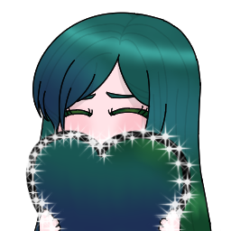
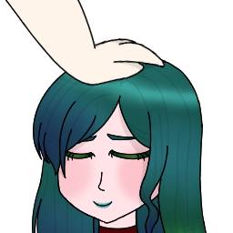

_updated fetching date.._

# thebelovedmoon, the First Maria🍃

**your precious 💚🍃Aga-chuu!!💗🌸 「VTresMarias - V三人のマリア - 」**

welcome to my personal profile!! here; you can find out the necessary info about me and my ventures!! you can also find out which orgs I associate (and maintain), and other efforts through forks!!

  
  

## Table of Contents

- [current affiliations](#current-affiliations)
- [as a VTuber..](#as-a-vtuber)
- [「VTresMarias - V三人のマリア - 」](#vtresmarias---v三人のマリア---)

# current affiliations

TBA

# as a VTuber..

TBA

# 「VTresMarias - V三人のマリア - 」

_info from the official website_

「VTresMarias - V三人のマリア - 」 was provisioned through a fanart from thebelovedmoon (the First Maria🍃) last 27 Dec 2022 as his way of appreciating his fellow VTubers -- Aura Ostara (the Second Maria🪷) and Hina Oujo (the Third Maria🌸).

this VTuber Collective has become the basis for the continuous support of the Marias throughout their VTubing career -- even beyond their hiatus.

in terms of [lore](https://vtresmarias.github.io/story), the Marias' story is culminated -- with the majority being the First Maria🍃's as it encompasses on how she was able to overcome the challenges to complete her underlying mission.

🍃🪷🌸

## our Core Values

### 「Universality without Borders」

our primary aim is to be open to all walks of life, whether it would be behind the screen or in front of a real person.

we do not permit any forms of negativity within our community and beyond. we strive to protect and support each other through trying times and not bring them down.

### 「Acceptance without Comprehension」

accompanying our aim for universality is our advocacy to accept everyone's flaws. our community strives on making sure everyone is widely accepted regardless of their nature.

but in order to maintain that acceptance, we have put additional measures to further strengthen our bond and to stay true to our promise of uniting the communities together as one.

<!-- scriptsheet -->

<!--
**thebelovedmoon/thebelovedmoon** is a ✨ _special_ ✨ repository because its `README.md` (this file) appears on your GitHub profile.

Here are some ideas to get you started:

- 🔭 I’m currently working on ...
- 🌱 I’m currently learning ...
- 👯 I’m looking to collaborate on ...
- 🤔 I’m looking for help with ...
- 💬 Ask me about ...
- 📫 How to reach me: ...
- 😄 Pronouns: ...
- ⚡ Fun fact: ...
-->